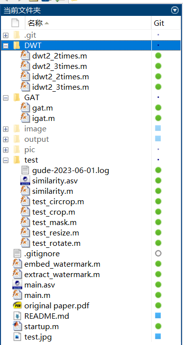
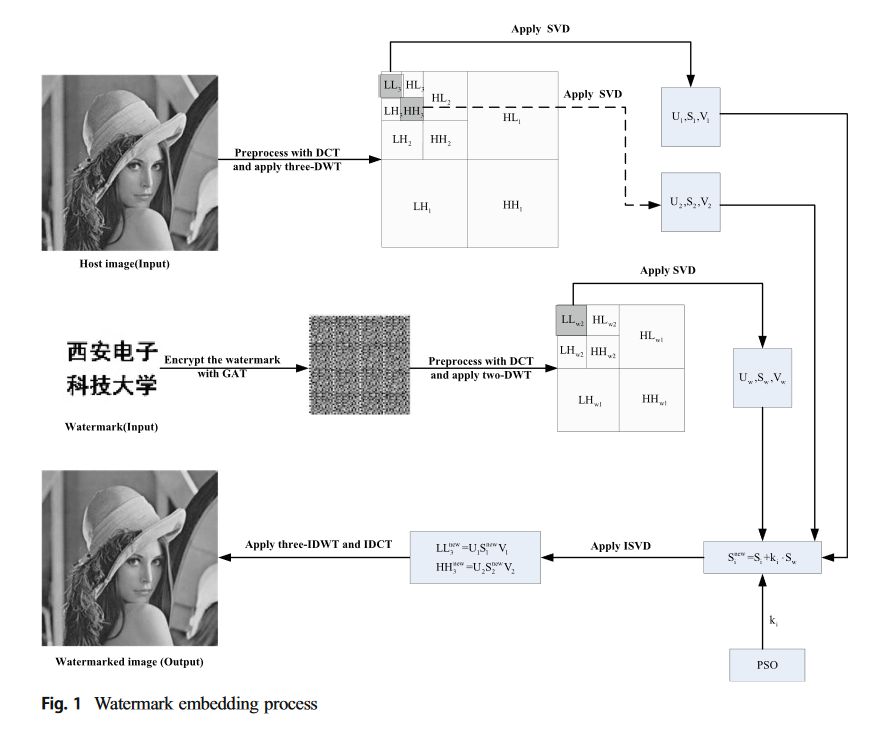
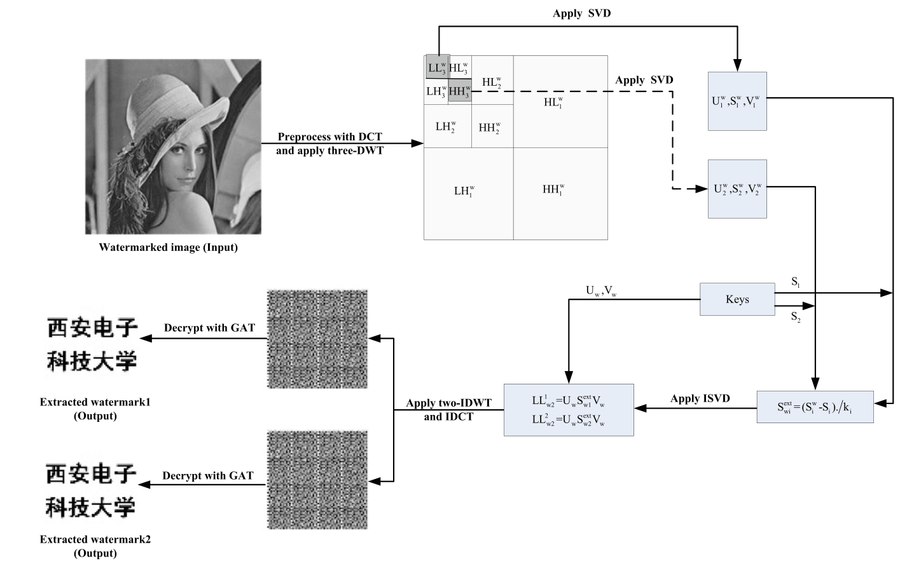
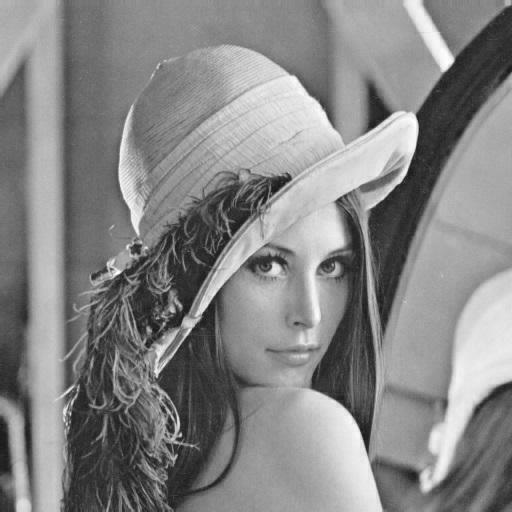
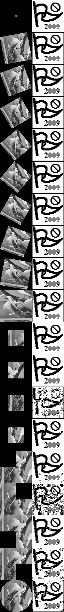

# DCT-DWT-SVD-digital-watermarking

这份代码是对这一篇论文的复现：“Dual DCT-DWT-SVD digital watermarking algorithm based on particle swarm optimization”
虽然马上你就会得知我没能全部复现该论文（恐怕并非能力问题，而是有些地方非常可疑，以及会导致效果变差（也许是没调好，总之现在效果不错））

论文地址：[here](https://cafetarjome.com/wp-content/uploads/1004/translation/c69f963fa0192e7e.pdf)

## 项目结构

有若干个重要的文件和文件夹：
1. main.m 这是主程序的入口，进入后会开始进行PSO迭代，并把参数、结果保存到output文件夹
2. embed_watermark.m / extract_watermark.m 分别对应了嵌入 / 提取水印的算法；这俩是核心代码，其他代码都是测试、优化用的辅助代码
3. DWT 文件夹包含了若干离散小波变换的工具，主要是辅助嵌入、提取水印算法。
4. GAT 文件夹包含了图像的GAT变换 / 逆变换工具，虽然现在没有用它（用了之后效果会差很多，暂不明确为什么）
5. test 文件夹包含了若干的测试代码，包括similarity计算图像相似性，以及放缩、旋转、截取、遮蔽等。
6. image 文件夹包含了基本的输入（经典的lena图像，网上的一个不知意义的水印图像），以及嵌入水印的图像（可能是PSO的临时文件）也会在这里。

默认的输入图片为512x512，水印图片为256x256（不符合的图片也会被放缩到这一大小后处理）。

只支持灰度图；多颜色通道的图可以考虑选择其中一个通道进行嵌入（代码里没有实现这一点）。

代码文件虽然很多，不过这是因为matlab一个文件只能有一个全局函数的缘故；代码逻辑非常简单，也就是从main进入，设置若干的参数后进入PSO优化，优化完成后退出。
一些重要的函数列在下面
1. embed_watermark 函数接收两个图像文件及其对应大小（默认即 $N=512$ , $M=256$ ），以及 $k_1, k_2$ 两个参数。函数返回嵌入后的图像，以及提取水印需要的key，即四个矩阵 $S_1, S_2, UW, VW$ 。图像要求为灰度图（从而只有一个通道），并且为double类型。
2. extract_watermark 函数接受已嵌入水印的图像，预期的水印图像，以及提取水印所需要的key。函数返回提取出来的图片中与预期水印图像最为接近的一者，以及两者的相关系数nc。
3. show_all_test 函数为main.m文件中的局部函数，作用是对已嵌入水印的图像做出一系列攻击，并再尝试提取出水印；它会返回一个由所有测试结果拼接成的图像（如markdown文档底部所示图片）。
另外，在攻击后尝试提取水印前，会先将攻击后的图片保存为jpg（因为保存为jpg会对图像进行压缩、失真），然后再读入文件，并且尝试恢复攻击前图片的状态（比如旋转45度攻击，则尝试逆时针旋转45度把图像摆正、截取出非黑部分），再提取水印。

更多的内容请见代码注释。

## 论文的嵌入算法流程

对 Watermark 图片的处理，先使用 GAT 方法进行打乱；GAT(Generalized Arnold transform) 是一种可逆的打乱图片的方法。

然后对其做 DCT + 两层DWT；为什么要做 DCT 不清楚；实验结果上，做了GAT和DCT后效果会变差，所以代码里没做。

然后对 DWT 的低频分量，也就是最左上角那块的方阵做 SVD 分解，保存左右两侧的 $U$ 和 $V$ （作为某种密钥），把方阵 $S$ 作为嵌入量

另一侧，输入图片也是 DCT + 三层DWT，并把左上角两个方阵的 $S_1, S_2$ 取出来，跟水印那边的$S$组合

$$ S_1^\prime = S_1 + k_i\cdot S$$

$$ S_2^\prime = S_2 + k_i\cdot S$$

$k_i$ 是神秘参数，是一个对角矩阵，由PSO进行优化。
然后把新的这个矩阵嵌回去，进行IDWT和IDCT生成一个打上了水印图片。

## 提取算法流程

首先提取算法是需要嵌入算法的 $U, V, S_1, S_2$ 四个矩阵的；不需要原图像。

考虑嵌入时所作的，是

$$ S_1^\prime = S_1 + k_1\cdot S $$

所以提取的时候所作的将是

$$ S = \frac{1}{k_1} (S_1^\prime - S_1) $$

因为在低频和高频信号上都做了嵌入，因此可以提取出俩 $S$ ；可能增加robustness吧。

**注意：** 这样计算得到的 $S$ 并不是原来的 $S$ ；因为 $U_1S_1^\prime V_1$ 的SVD得到的中间项并非原来的 $S_1^\prime$ 。它们会相差不多吗？不确定；从结果上来看是差不多。

算出了$S$后，再使用喜闻乐见的IDWT直接把这一低频信号转换回去。根据DWT的原理来说，低频信号保留了图像的基本结构，因此只要不是极其精致的水印，损失应该不大。

## 日志
#### 20230531
首先不清楚的事不要做：
1. 为什么俩方阵大小能对上？
2. 为什么要DCT？
3. PSO是什么玩意？

所以说不失一般性，先假定水印图片大小是原图的二分之一，这样正好方阵大小能对齐；DCT和PSO先跳过， $k$就当个小常数；先能输出图片再说。

#### 20230531
提取也做好了，matlab在这些计算方面实在太好用了。

今天先丢这了.jpg

#### 20230601
准备加入DCT，加入GAT

测了一下午，这俩玩意不是很可靠，会导致各种各样的提取水印失败……

所以还是不知道为什么需要做这俩玩意，在不做的表现很好的情况下

先进行robustness测试吧，有哪项通不过了再看。

Robustness 测试结果尚可，有两处测试没法通过；一处是遮蔽左下角的1/4，一处只截取左下角的1/4（奇怪的是，当我只截取图的1/16时，一切都好）
另有两处质量较差，分别是遮蔽/截取右上角的1/4。

明天写PSO优化，把参数 $k_1, k_2$ 调好，不知能否解决上述问题。

#### 20230602
加入了PSO优化；PSO指的是Particle Swarm Optimization，一种随机优化算法。

原来的公式为

$$ \text{fitness} = -\frac{\text{PSNR} + \sum_{\text{all\ test}}NC }{\text{number of tests}} $$

, which does not make any sense...
首先是这个除以 $n$ 的正则化毫无必要，因为 $n$ 是个常数；然后峰值信噪比这东西，如果你对原图像一模一样不改，它的值是 $\frac{1}{0}=+\infty$ ，所以后面一项根本不被考虑……

然后根据个人理解，转而尝试了这样一个目标函数（PSO尝试求其最小值，也就是各NC尽可能大）

$$ \text{fitness} = \begin{cases}
100-NC_0 & \text{if } NC_0<0.999\\
-\sum_{\text{test\ }i}c_iNC_i & \text{otherwise}
\end{cases}$$

$c_i$ 是一些常系数，用来调整各项的比重； $NC_0$ 为嵌入图像与原图像的相关系数（correlation coefficient）。也就是说，我们要求
1. 嵌入水印后，与图像的区别不大，否则我们把与原图像的相关系数作为优化对象。
2. 在嵌入水印的图片有了质量保证后，优化其他测试下提取出的水印质量；测试包括放缩、旋转、裁剪、覆盖等

另外，函数的变量是 $k_1$ 与 $k_2$ ，此处为对角矩阵（应该符合原论文意思？
如果是一般的矩阵就必须保证满秩了），也就相当于一个128维的变量。

目前还在迭代；挂机一晚上先，明早起来看。

#### 20230603
昨晚的PSO迭代跑完了，效果如图

应该说还是相当不错了；唯一非常勉强的一项是只截取保留左下角。